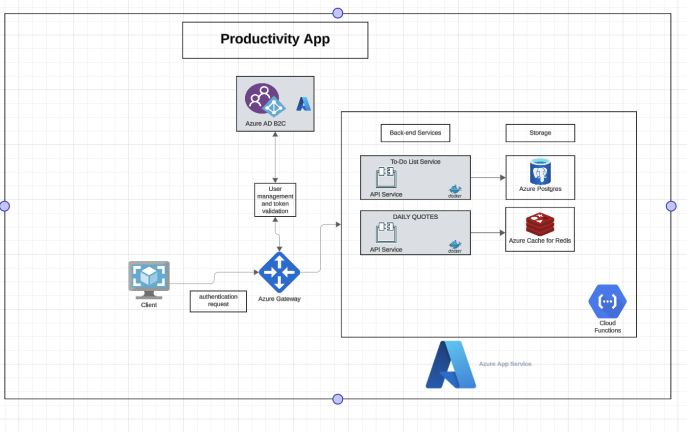

# 🚀 Productivity App: AI Meets Microservices!

Welcome to the **Productivity App**! This is not just another productivity tool—it’s your AI-powered personal assistant, built with cutting-edge **microservices architecture** for maximum scalability and flexibility.

Whether you're tackling tasks, jotting down ideas, or optimizing your daily routine, this app has your back with features powered by **Node.js**, **Python**, **TypeScript**, and **Azure AI Services** with the help of the one and only **Github Copilot**.

---

## 🌟 Core Features  

### 📝 To-Do List Service  
- Keep it simple with a user-friendly to-do list.  
- Feeling overwhelmed? Let our AI generate **personalized task lists** based on your goals.  

### ✍️ Note Service  
- Take traditional notes or brainstorm effortlessly with **AI-powered autocomplete**.  
- **Audio-to-Text:** Convert your voice recordings into notes—perfect for hands-free productivity! *(coming soon)*

### 🕒 Routine Service  
- Build daily or weekly routines manually, or let AI suggest **optimized schedules** tailored to your preferences.  

### 💡 Daily Quotes Service  
- Start your day with **motivational quotes**, powered by large language models (LLMs), to keep you inspired.  

### ⏱️ Pomodoro Service  
- Boost productivity with a customizable **Pomodoro timer**.  
- Enhance your focus with AI-generated **study music** or ambient sounds during your work sessions.  

---

## 📊 System Design  

Below is the architecture of our Productivity App, showcasing its microservices design and integrations:

---

## ⚙️ Tech Stack  

This app brings together a powerful combination of tools and frameworks:  
- **Node.js**: Backend magic for seamless service handling.  
- **Python**: For AI-powered functionalities and machine learning models.  
- **Azure AI Services**: Advanced AI integrations to elevate user experience.  

---

## 🎉 Why You'll Love This App  

- Modular microservices: Every feature is independent, ensuring smooth scalability and updates.  
- AI at your service: From personalized task lists to motivational quotes, it's all about **you**.  
- Stay focused, stay inspired, stay productive.  

---

## 🚧 What's Next  

We’re just getting started! Future updates may include:  
- Collaborative features to share tasks and notes.  
- Integration with popular calendars like Google Calendar.  
- Gamification elements to make productivity even more rewarding!  

---

💻✨
